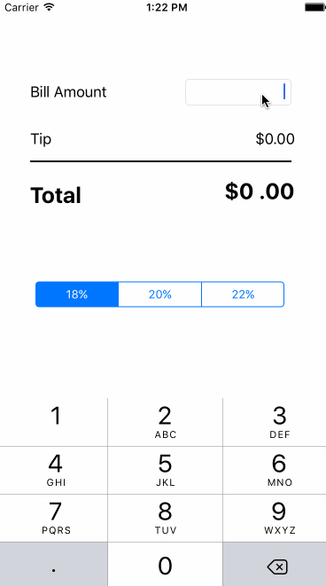

# Tips Calculator Demo

This is an iOS application demonstrating the basic functionality of a tip calculator. Math is hard, so there's an app for that!  See CodePath's ["Thanks for applying!"](http://courses.codepath.com/snippets/ios_for_designers/thanks_for_applying#heading-prework) page for more details.

Time spent: 1.5 hours spent in total

Completed user stories:

 * [x] Required: User can input a total bill amount, in turn calculator the tip % and total amount to be paid
 * [x] Required: User can toggle different percentages (18,20,22) via a segmented control to adjust the desired tip amount

Walkthrough of all user stories:

GIF created with [LiceCap](http://www.cockos.com/licecap/).
